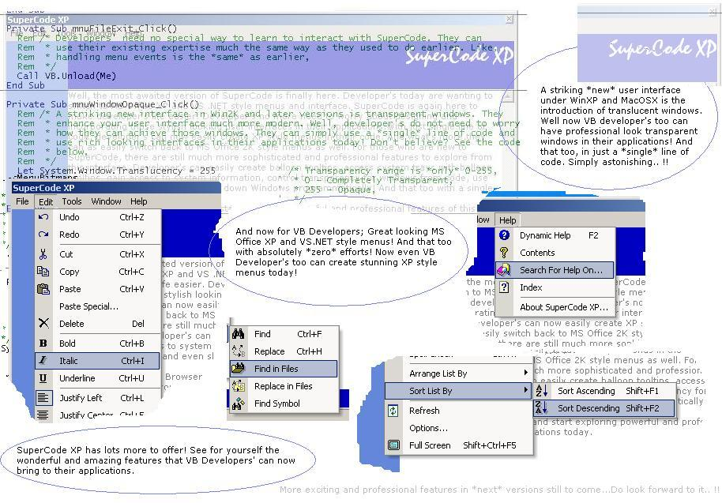

<div align="center">

## SuperCode XP


</div>

### Description

Well, now VB developers do not have to worry any more about API's for having XP style custom menus, translucent windows, system information, system tray access, multiline and balloon tooltips. All are under *one* roof. Just a reference to a DLL to your VB project and that's it. With just one line of code, you can create *wonders* to VB code and that too very very professional.

Making Developer's Life Easier.. !!
 
### More Info
 


<span>             |<span>
---                |---
**Submitted On**   |2002-10-01 02:21:02
**By**             |[Shantibhushan Naik](https://github.com/Planet-Source-Code/PSCIndex/blob/master/ByAuthor/shantibhushan-naik.md)
**Level**          |Advanced
**User Rating**    |4.6 (371 globes from 80 users)
**Compatibility**  |VB 4\.0 \(32\-bit\), VB 5\.0, VB 6\.0
**Category**       |[OLE/ COM/ DCOM/ Active\-X](https://github.com/Planet-Source-Code/PSCIndex/blob/master/ByCategory/ole-com-dcom-active-x__1-29.md)
**World**          |[Visual Basic](https://github.com/Planet-Source-Code/PSCIndex/blob/master/ByWorld/visual-basic.md)
**Archive File**   |[SuperCode\_1389081012002\.zip](https://github.com/Planet-Source-Code/shantibhushan-naik-supercode-xp__1-39406/archive/master.zip)

### API Declarations

```
Rem /* You find most of them in source code,
Rem * Unzip contents to a seperate folder,
Rem * and run *setup.bat* for an automated
Rem * demonstration,
Rem */
```


